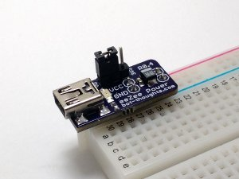
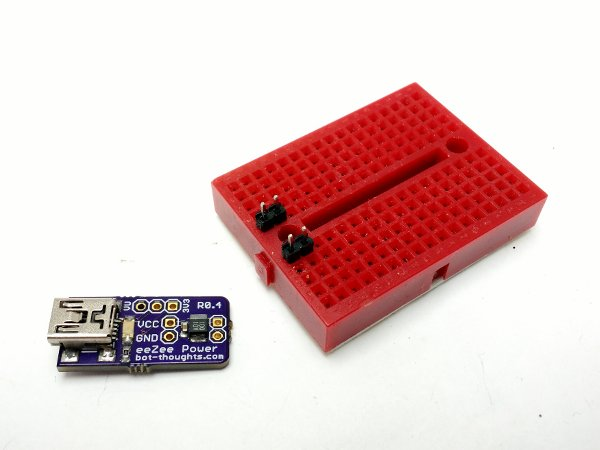
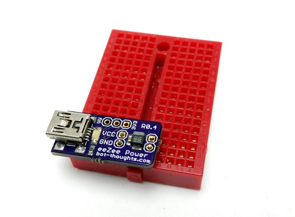
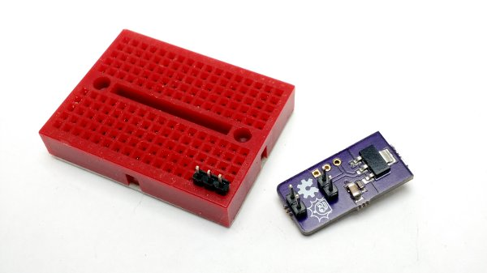
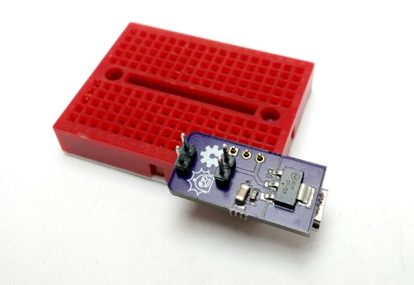
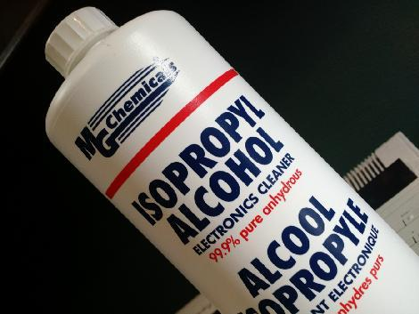
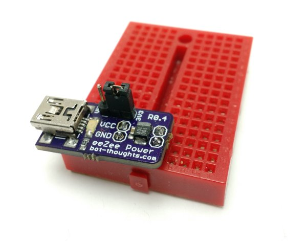
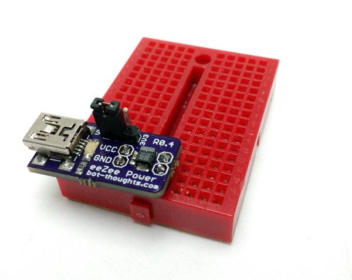

# eeZee Power User Guide

A tiny, affordable breadboard power supply, eeZee Power is powered from common
USB cables that plug into your computer or a phone charger, delivering regulated
3.3V or 5V from the USB connector. If that sounds convenient, then
[buy one on Tindie](https://www.tindie.com/products/bot_thoughts/eezee-power/).

## Getting Started

* Install pin headers
* Place the selector jumper...
  * On the 3V3 side for 3.3V
  * On the VU side for VUSB (~5V)
* Find a mini-B USB cable
* Find a USB phone charger or use your computer
* Plug the cable into the power source and eeZee Power
* Align VCC/GND to the power rails on your breadboard
* Insert eeZee Power into the breadboard

## How to Assemble

Assembly is easy. And, you can learn how to solder at the same time. Review [Sparkfun's Soldering Tutorial](https://learn.sparkfun.com/tutorials/how-to-solder---through-hole-soldering) if you need to. Here's a helpful info-graphic from the tutorial:

### You'll need
* Soldering iron, 40W
* Sponge to clean the iron (I recommend a brass sponge)
* Workbench with plenty of light
* Ventilation since breathing flux fumes is irritating
* Soldering surface (e.g., marble tile sample)
* Rosin core solder 0.022” or 0.032” diameter
* Kester #2331-ZX flux pen (optional)

### Power pins
Start by placing a pair of 2-pin headers in a breadboard, spaced 0.4” apart
(two holes between).

Place the eeZeePower board onto the pin headers, with USB connector on top

Hold eeZeePower in place and solder on the two sets of headers.

### Selector pins

Now, install the 3-pin header on the top (USB connector side) of the VU/3V3
pads.

This is kind of tricky, because there's no good way to hold it in place and you
have to be careful that you don't burn your fingers while holding the 3-pin
header.

I usually tack one of the outer pins in place with the board upside down.

The result is a crooked pin header. I then carefully apply pressure to an
unsoldered pin while re-melting the soldered pin, and nudge the pin header to
a vertical position.

### Cleanup

You'll want to remove the rosin and flux

I usually just use isopropyl alcohol and an old toothbrush

You can also buy chemicals specifically for removing flux and rosin

## How to use

eeZee Power is designed to be installed into the power rails on a typical
solderless breadboard.

For 3.3V operation, install the jumper across the 3V3 and center pins of the
3-pin header.

To power directly from the USB connector's VUSB pin (typically ~5V), place the
jumper across the VU and center pins of the 3-pin header.

## Specifications

Changes to Rev 0.5 vs. Rev 0.4:

  * Vin MAX = 6V
  * Vin MIN = 3.3V + 1.2V @ 800mA
  * All capacitors are rated 25V or higher
  * Integrated two-layer copper heatsinks with thermal vias

Changes to Rev 0.4 vs. Rev 0.5:

  * Vin MAX = 6V
  * All capacitors rated 10V or higher

Rev 0.3 or older:

  * Vin MAX = 5V, **do not exceed**
  * Vin MIN = 3.3V + 1.2V
  * All capacitors are rated 6.3V or higher
  * PCB features an integrated 1cm2 copper heatsink.
  * Output current for regulated 3.3V: see *3.3V Regulator*
    * If exceeding 500mA, **monitor board temperature**

All eeZee Powers use one of the following 3.3V SOT-223 regulators:

  * ST Micro LD1117S33TR
    * rated at 800mA, max
    * current and thermal limit
    * Datasheet: [LD1117.pdf](http://www.st.com/web/en/resource/technical/document/datasheet/CD00000544.pdf)
  * On Semi NCP1117ST33T3G in SOT-223
    * rated at 1A, max
    * current limit, safe operating and thermal shutdown protection.
    * Datasheet: [NCP1117ST33T3G.pdf](http://datasheet.octopart.com/NCP1117ST33T3G-ON-Semiconductor-datasheet-11536806.pdf)
